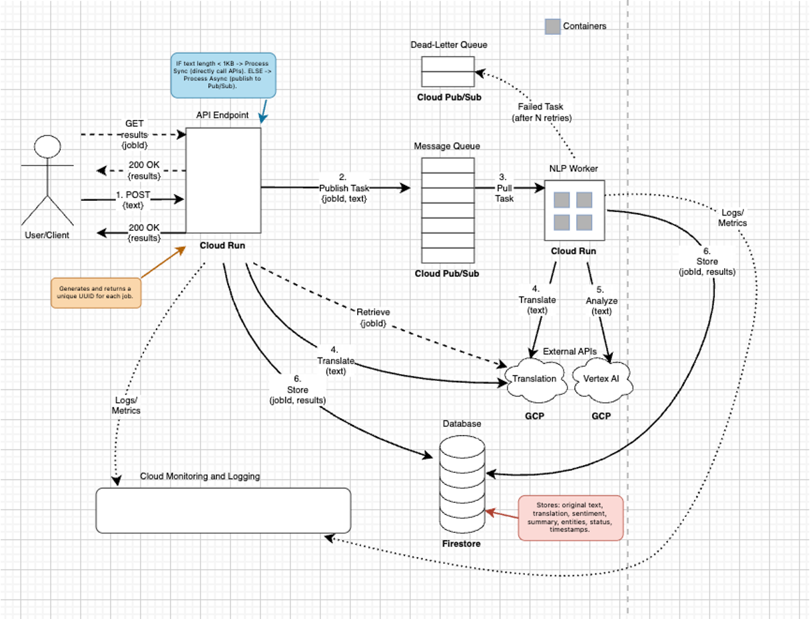
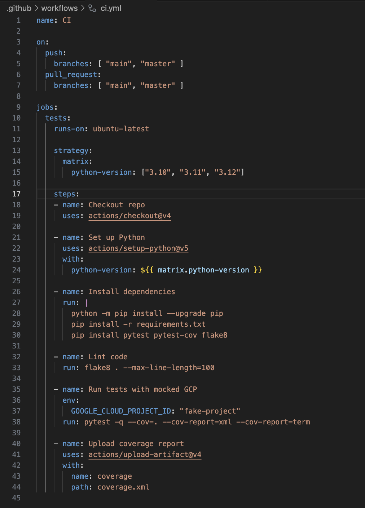

# Multilingual Text Intelligence Cloud Service Final Report

By: Deep Shukla, Kendall Ahern, Mateusz Muszynski

CSCI 5253 Final Project Report

Link to Github: [https://github.com/mateusz-muszynski/CSCI-5253-Final-Project](https://github.com/mateusz-muszynski/CSCI-5253-Final-Project)

Link to Final Video: 

---

### Abstract: 
This project implements a cloud-native Multilingual Text Intelligence Service that ingests user text in arbitrary languages and returns standardized English outputs which include the implementation of sentiment classification, summarization, and named-entity recognition. The service demonstrates a microservices-based, event-driven architecture built on Google Cloud Platform (GCP - chosen becuase of our experience working with it in class) primitives and containerized application code. The primary goal of our project was to design and implement a distributed datacenter service that uses at least four datacenter technologies from class, exercises synchronous and asynchronous processing modes, and provides a reproducible testing and monitoring strategy that would be acceptable for class evaluation and grading. The implementation provides a working API and background worker, an extensible NLP (stands for Natural Language Processing) service interface, a Pub/Sub-based asynchronous pipeline, and a Firestore-backed persistence layer; these components together validate the project’s design goals for scalability, modularity, and observability.

### Motivation and Scope:
Modern organizations routinely receive user-generated content in many languages from multiple channels such as reviews, support tickets, and social media posts. Manual translation and the current fragmented analytic tool-box create translation and workflow bottlenecks for teams that need fast, consistent insights across different sites, settings, locations, etc. Our project focuses on a realistic and practical slice of that problem: automatic detection and translation to English, extraction of sentiment and entities, and generation of concise summaries. The scope intentionally focuses on text-only input to concentrate effort on the distributed systems aspects of a cloud service  which include task routing, queueing, persistence, and observability. Additionally, we chose to leave the open model selection as a modular component that can be swapped between managed services - desoigned with Vertex AI and self-hosted Hugging Face models in mind.

### System Architecture and Design Decisions: 
The system was designed as a set of small, focused services that communicate via well-defined interfaces. An API service implemented with FastAPI serves as the public entry point, responsible for request validation, job creation, and routing between synchronous and asynchronous processing modes based on text length. For asynchronous processing (longer text inputs) the API publishes job messages to a Pub/Sub topic; a background worker service subscribes to that topic, performs the translation and NLP analyses, and writes results back to persistent storage. The design emphasizes separation of concerns: translation is handled by a dedicated translation service wrapper so the NLP models receive normalized English text; the NLPService class is intentionally modular so model implementations can be swapped without changing API or worker logic. The data model centers on a job document that tracks lifecycle states (pending, processing, completed, failed), timestamps, metadata, and structured result fields for sentiment, summary, and entities. We also had to consider the observability at API and worker boundaries. Fot the final version, we used structured logging and Cloud Monitoring to capture latency, error rates, and job throughput for debugging and performance assessment.

### Implementation Highlights: 
The API implements two processing modes: synchronous processing for short inputs and asynchronous processing for long inputs or heavy tasks. Synchronous processing essentially "short-circuits" the pipeline by invoking the translator and NLP services inline. This returns a completed job response to the caller and persisting results immediately - which is the result we expected. The asynchronous mode, on the other hand, must rely on additional components. It generates a unique job identifier and enqueues the job to Pub/Sub which enables scalable, fault-tolerant background processing. The worker pulls messages from Pub/Sub, updates the job status to processing, performs language detection and translation, executes the NLP service methods for sentiment, summarization, and entity extraction, persists the full processing result to Firestore, and ultimately updates the job status to completed or failed. The `nlp_service.py` was designed with clear docstrings defining the contract between the various services from the natural language processing component. That is, analyze_sentiment must return a label and score, summarize must return a concise string, and extract_entities must return a list of structured entity records. Throughout development, placeholders were used to preserve the contract and allow for unit testing and integration - the unit tests can be found in the `tests/` folder in the repo.

### Software Components Used:

- **Google Cloud Run**: a managed container runtime for serverless deployment; we used Cloud Run to host both the API and the background worker as containerized services, enabling rapid deployment and automatic scaling of service instances without manual VM administration.
- **Google Cloud Pub/Sub:** a distributed message queue and event bus; Pub/Sub provides reliable, what's known as "at-least-once" delivery for queued jobs and decouples API request handling from worker processing so the system can absorb "bursts" in queries and perform work asynchronously.
- **Google Cloud Translation API:** a managed translation service with language detection; this component is used to detect source languages automatically and produce English translations that feed into the downstream NLP models. This simplifyies the model requirements and improves consistency.
- **Vertex AI / Hugging Face models** model hosting and inference options; Vertex AI is the managed path for production deployment while Hugging Face models can be containerized and deployed to Cloud Run for cost control and transparency. We designed a model-agnostic NLPService interface so either option can be integrated without changing the rest of the pipeline logic.
- **Google Firestore:** a NoSQL document database for job persistence; Firestore stores job metadata, status history, input and output texts, model confidences, and timestamps so API clients can query job results and examine processing outcomes.
- **Google Cloud Logging and Monitoring:** observability tools for telemetry; these services collect structured logs, metrics, and alerts to monitor latency, error rates, and resource usage across services during testing and deployment.
- **FastAPI:** a high-performance Python web framework; FastAPI is the basis of the API service and provides request validation through Pydantic models, OpenAPI schema generation for documentation, and performance suitable for synchronous processing paths.
- **Docker:** containerization tooling; Dockerfiles and Cloud Build configurations package services for Cloud Run and standardize runtime environments across development and production.

Here is our overall architechture diagram to give you some idea how all of these components fit together.

### Testing and Validation: 
Testing is organized into unit tests, integration tests, and end-to-end simulated runs. Unit tests focus on API routing and contract compliance using FastAPI’s TestClient and pytest; they mock the database, translation, and NLP services to validate request validation, synchronous vs asynchronous routing, and error paths. The worker is covered by integration tests that assert state transitions and persistence behavior, using a Firestore in-memory test double to simulate database interactions without requiring access to a real GCP project. The first stage of testing was all done locally on a laptop in an attmept to verify that indiviual components were working as they should. Other classes have taught me that it is important to debug as you build because that can save you a lot of headache. Because of the nature of this group project, it was essential that we did some unit testing and loose robustness checking on the individual components before scaling up to the entirety of our application. Continuing the discussion around tests, Pub/Sub and Firestore interactions are mocked in CI to enable deterministic, fast runs, and we included tests that simulate Pub/Sub message delivery to the worker callback to validate ack/nack behavior. 

Model evaluation uses public multilingual datasets once we deemed them to be appropriate; evaluation metrics for classification and entity extraction include F1 and precision/recall, which are common machine learning evaluation methods, while summarization is measured with ROUGE scores (a metric used to evaluate the quality of automatically generated text). During early development we used lightweight manual checks against Google Translate and human inspection for qualitative verification of both sentiment and summary output components.

### Results and Performance Observations: 
During functional testing the service correctly routed short requests synchronously and queued larger requests for background processing. The mocked tests validated correct persistence of job metadata and structured results. Latency measurements in local and Cloud Run test deployments showed that synchronous short-text processing completed within a few hundred milliseconds when model calls were run locally in the same container. In contrast, however, end-to-end asynchronous processing latency was dominated by queuing and worker scheduling times. The modular approach allowed us to trade off latency and cost by choosing between managed endpoints and containerized model inference. Observability dashboards recorded request rates, average processing latency, and error trends. These were essential for identifying transient failures - temporary, short-lived error that resolves itself and often happens sporadically, making it difficult to reproduce - during worker restarts and for refining retry settings and dead-letter topic handling for trying to migitage and negative effects as a result of some failure.

### Challenges and Lessons Learned: 
The primary engineering challenges were integrating third-party NLP services in a way that preserved portability and testability, and designing a robust asynchronous pipeline with clear failure semantics. Translating text reliably across many languages introduced edge cases with low-use or low-resource languages as well as long text pieces. Once we implemented the translation API, it solved much of this but introduced additional API latency and cost considerations. 

Another lesson was the importance of explicit contracts between services. We talked about these contracts a lot in class when it came to networking protocols, but I did not realize the importance of that else-where until this project. We used well-documented function signatures and Pydantic schemas to ensure that replacing placeholder model implementations with real models did not break downstream code. Testing distributed systems proved to be non-trivial, and creating in-memory doubles for Firestore and rigorous mocking for Pub/Sub was necessary to achieve fast, repeatable CI while preserving realistic behavior.

### Security, Privacy, and Compliance Considerations: 
The service treats input text as potentially sensitive user data. In production, the design would have to enforce strict IAM policies for Cloud resources, enable audit logging, and apply data retention and deletion policies that are consistent with organizational requirements. For production level models, if proprietary or personal data are processed, we would have to consider encryption in transit and at rest which would limit model logging of raw inputs. Additionally, it would be beneficial to offeri configurable anonymization or redaction mechanisms to help ensure user privacy - especially in a society where that is such a controversial issue. Using managed translation and model services implies data transfer to external endpoints and those are trade-offs that must be approved by data governance owners before processing sensitive content.

### Future Work and Extensions: 
We thought of several practical extensions that could improve both the functionality and production readiness of our application. The first would be integrating a model management layer to evaluate and route requests to specialized models (e.g., domain-specific sentiment models) which could improve accuracy. Second, we thought that a persistent job status stream (webhooks or websockets) could enable more interactive client experiences - though none of us have much experience working with something like that. Third, autoscaling worker pools and fine-grained retry and backoff policies for Pub/Sub subscriptions would improve throughput under increased or unpredicted loads. Finally, as mentioned breifly in the security section, adding privacy-preserving options such as client-side anonymization, or model hosting in a private VPC, would broaden the range of acceptable data for processing.

## Conclusion: 
Our project The Multilingual Text Intelligence Service demonstrates how microservices and managed datacenter technologies can be combined to solve practical multilingual analysis problems at scale. By separating the translation, model inference, persistence, and orchestration concerns, the project achieves modularity that simplifies testing and evolution. The current implementation meets the course requirement to incorporate multiple datacenter technologies and provides a clear pathway to production-quality deployment with incremental improvements to models, monitoring, and privacy controls.